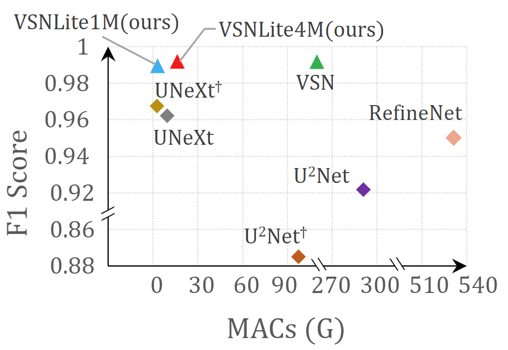
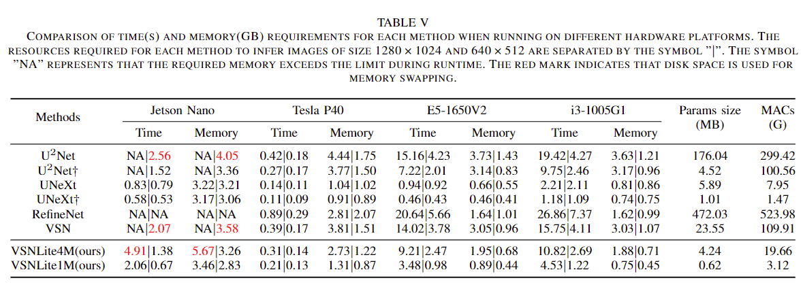

#  Lightweight Segmentation Neural Networks for Measuring Vickers Hardness  



The repository manages the code and some of the utilities related to our project **VSNLite**.

Compared to previous methods, the proposed networks achieve a reduction of 35.2 times in terms of computational cost with up to 38 times fewer parameters, while maintaining the same level of segmentation accuracy.



The code of the VSNLite project will be synchronized to this repository after the acceptance of the paper.

------

# Application

Our approach has been successfully applied to commercial software, and the GIF below shows how it works in practice.


------

# Usage

1. Clone this repo

```shell
git clone https://github.com/SimonLeeCHN/VSN.git
```

2. Install requirements

Please refer to *VSNLite/requirements.txt*. You can use the following command to automatically install the required Python packages.

```shell
pip install -r VSNLite/requirements.txt
```

3. Start training your model by using the file *VSNLite/train.py*, or use *VSNLite/predict.py* to load pre-trained model weights for testing.

# Training

```shell
> python train.py -h
usage: train.py [-h] --model MODEL [-e E] [-b [B]] [-l [LR]] [-s SCALE] [-v VAL] [-f LOAD] [--use-KD] [-t TMODEL]
                [--lambda-t LAMBDA_T] [--lambda-pi LAMBDA_PI] [--lambda-pa LAMBDA_PA]

Train the net on images and target masks

options:
  -h, --help            show this help message and exit
  --model MODEL, -m MODEL
                        Specify the model to be used (default: None)
  -e E, --epochs E      Number of epochs (default: 5)
  -b [B], --batch-size [B]
                        Batch size (default: 1)
  -l [LR], --learning-rate [LR]
                        Learning rate (default: 0.0001)
  -s SCALE, --scale SCALE
                        Downscaling factor of the images (default: 1)
  -v VAL, --validation VAL
                        Percent of the data that is used as validation (0-100) (default: 10.0)
  -f LOAD, --load LOAD  Load model from a .pth file (default: False)
```

When training with your own dataset, you need to modify the following variables in the *VSNLite/train.py* file:

```python
dir_img = <YOUR DATASET IMG>
dir_mask = <YOUR DATASET MASK>
dir_checkpoint = <where to store checkpoint>
```

If you want to use the default hyperparameters, during training, you only need to provide the model architecture you want to train:

```shell
#VSNLite4M
python train.py -m VSNLite4M
#VSNLite1M
python train.py -m VSNLite1M
```

The training module integrates TensorBoard, and the data during the training process will be saved in the *VSNLite/runs* folder. You can visualize in real time the train and test losses, the weights and gradients, along with the model predictions with TensorBoard:

```shell
tensorboard --logdir=runs
```

# Prediction

```shell
> python predict.py -h
usage: predict.py [-h] --model MODEL --input INPUT [INPUT ...] [--is-dir] [--output INPUT [INPUT ...]] [--viz]
                  [--no-save] [--mask-threshold MASK_THRESHOLD] [--scale SCALE] [--get-MCR]

Predict masks from input images

options:
  -h, --help            show this help message and exit
  --model MODEL, -m MODEL
                        Specify the model to be used (default: None)
  --input INPUT [INPUT ...], -i INPUT [INPUT ...]
                        filenames of input images (default: None)
  --is-dir, -d          Declare the input path as a directory (default: False)
  --output INPUT [INPUT ...], -o INPUT [INPUT ...]
                        Filenames of ouput images (default: None)
  --viz, -v             Visualize the images as they are processed (default: False)
  --no-save, -n         Do not save the output masks (default: False)
  --mask-threshold MASK_THRESHOLD, -t MASK_THRESHOLD
                        Minimum probability value to consider a mask pixel white (default: 0.5)
  --scale SCALE, -s SCALE
                        Scale factor for the input images (default: 1)
  --get-MCR             Save the maximum connected region rather than the raw predict result (default: False)
```


# Useful tools

